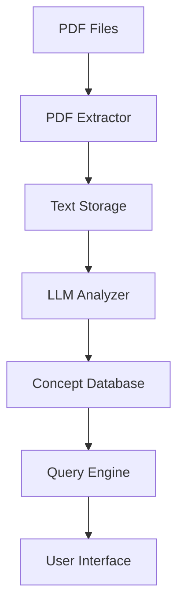

# System Patterns: Past Paper Concept Analyzer

## 1. System Architecture

The system follows a modular pipeline architecture with clear separation of concerns:

## 2. Key Components

### PDF Processing Layer
- **PDF Extractor**: Responsible for reading PDF files and extracting the text content
- **Text Storage**: Temporary or permanent storage of extracted text with metadata

### Analysis Layer
- **LLM Analyzer**: Interfaces with a Large Language Model to:
  - Identify key concepts and terms
  - Categorize concepts into subject areas
  - Extract contextual information
- **Prompt Engineering**: Design of effective prompts to guide the LLM

### Data Storage Layer
- **Concept Database**: Schema-driven storage for:
  - Concepts and terms
  - Metadata (paper, year, question)
  - Relationships between concepts
  - Frequency and context information

### Access Layer
- **Query Engine**: Backend logic for querying the database
- **User Interface**: Frontend for exploring the data (CLI or web-based)

## 3. Technical Decisions

1. **Pipeline Processing**: Each paper flows through the system independently
2. **Event-Driven Design**: Components communicate via events to maintain loose coupling
3. **Stateless Processing**: Each component performs its function without maintaining state
4. **Idempotent Operations**: Processing can be retried safely in case of failures
5. **Incremental Processing**: New papers can be added to the system without reprocessing old ones

## 4. Data Flow

1. Papers are ingested and queued for processing
2. Text is extracted and stored with metadata
3. The LLM analyzes texts to extract concepts
4. Concepts are stored in the database with citations
5. The database supports queries for analysis and exploration
